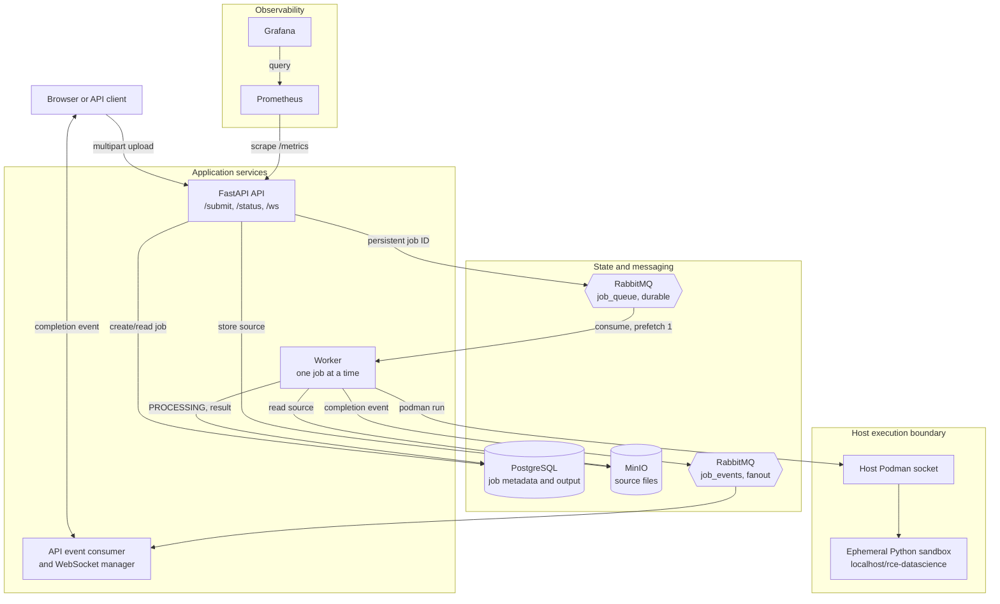
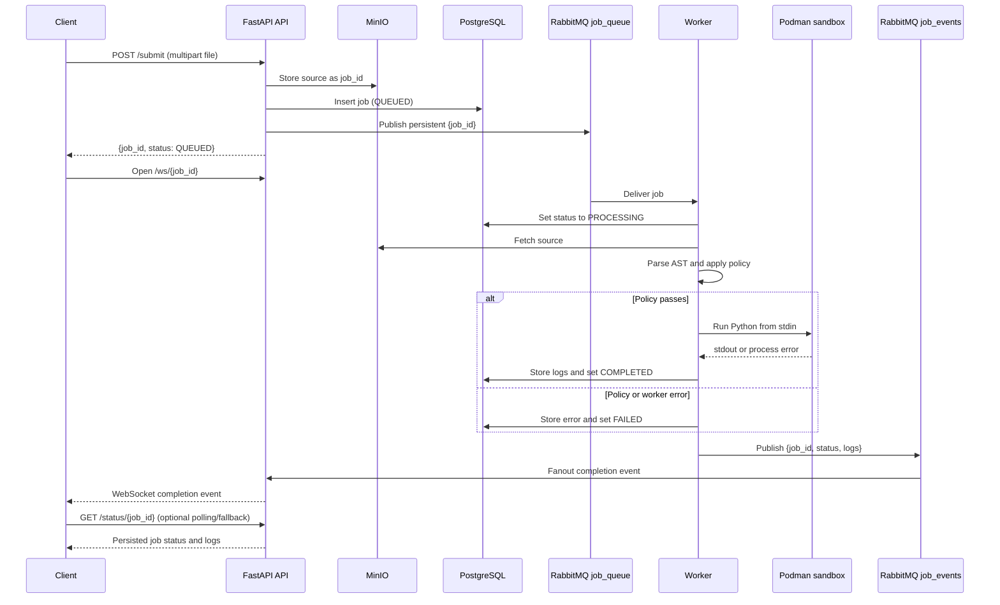

# Distributed Remote Code Execution Engine

An asynchronous Python execution service. Clients upload a script to the FastAPI API; the API records a job, stores the source in MinIO, and places the job ID on a durable RabbitMQ queue. A worker retrieves the source, applies an AST-based policy check, executes it in a short-lived Podman container, and persists the result.

> This is a development/demo system for executing untrusted Python. It has meaningful sandbox controls, but it is not a complete multi-tenant production security boundary. Review the [Security model](#security-model-and-limitations) before exposing it to untrusted users.

## Architecture



### Job lifecycle



The API and worker are independently scalable processes. Each worker uses RabbitMQ QoS `prefetch_count=1`, so it processes one job at a time; increase worker replicas to increase execution concurrency.

## Components

| Component | Responsibility |
| --- | --- |
| FastAPI (`api/server.py`) | Serves the demo UI, accepts source uploads, creates jobs, publishes job IDs, provides status reads, exposes `/metrics`, and forwards completion events to connected WebSockets. |
| PostgreSQL (`api/models.py`) | Stores job ID, original filename, status, submission time, and final output/error text. |
| MinIO | Stores each uploaded source file under its job ID in the `code-uploads` bucket. Uploads run through a 100-thread executor so the FastAPI event loop does not perform the blocking MinIO call. |
| RabbitMQ | Carries durable job messages on `job_queue`. The worker publishes terminal job events to the fanout `job_events` exchange. |
| Worker (`worker/main.py`) | Claims jobs, updates durable job state, fetches and scans source, starts the sandbox, stores output, emits an event, and acknowledges the message. |
| Podman sandbox (`worker/run_container.py`) | Runs `localhost/rce-datascience` with source piped through standard input and removes the container when it exits. |
| Prometheus and Grafana | Prometheus scrapes API metrics every five seconds; Grafana provisions Prometheus as its datasource. |

## API

| Endpoint | Behavior |
| --- | --- |
| `POST /submit` | Accepts one multipart form field named `file`. It returns a UUID job ID and `QUEUED` after object upload, database insert, and attempted queue publication. |
| `GET /status/{job_id}` | Returns the stored status, submission time, and final logs. Returns `404` for an unknown job. |
| `WS /ws/{job_id}` | Receives a terminal `{job_id, status, logs}` event when the API process is connected to RabbitMQ and has an active socket for that job. |
| `GET /metrics` | Prometheus metrics exposed by `prometheus-fastapi-instrumentator`. |
| `GET /` | Minimal browser client served from `static/index.html`. |

WebSockets deliver a single terminal result event, not live stdout/stderr streaming. The connection manager is in process, so WebSocket delivery is tied to the API replica that owns the client connection; use `GET /status/{job_id}` to read durable state.

## Security model and limitations

The worker treats uploaded code as hostile and applies layers of restriction:

| Layer | Implementation |
| --- | --- |
| Early rejection | AST policy rejects selected imports (`os`, `subprocess`, `socket`, and others) and calls such as `eval`, `exec`, `open`, and `input`. |
| Network isolation | Each sandbox is started with `--network none`. |
| Resource limits | Podman limits the sandbox to 128 MiB memory, 0.5 CPU, 64 PIDs, and a 10-second parent-process timeout. |
| Linux privileges | The sandbox receives `--cap-drop=ALL` and the repository seccomp profile. |
| Source handling | Source is passed on standard input rather than mounted into the sandbox. |

Important limitations:

- The AST policy is a convenience filter, not a security boundary. It is incomplete and can reject otherwise valid programs.
- `run_code_in_container` returns a non-zero exit or timeout as text. The current worker records that result as `COMPLETED`; only AST failures and worker exceptions are stored as `FAILED`.
- The Compose worker is `privileged`, uses host networking, disables SELinux labeling, and mounts a host Podman socket. Anyone able to control the worker has a high-impact path to the host. Treat the worker environment as trusted infrastructure.
- There is no authentication, authorization, upload size limit, per-user quota, or production-grade audit trail.
- A failed RabbitMQ publish is logged but the API still returns `QUEUED`, leaving a persisted job that may never run.

## Run locally

### Prerequisites

- Linux host with Podman and `podman-compose`
- A rootless Podman socket available at `/run/user/1000/podman/podman.sock`, or an adjusted bind mount in `compose.yaml`
- Python 3.13 and [uv](https://docs.astral.sh/uv/) for local tooling

### Configure

Create `.env` from the repository template, then update it for this Compose configuration:

```bash
cp env.example .env
```

Set these values in `.env` before starting services:

```dotenv
# Values must match the database and RabbitMQ service credentials in compose.yaml.
POSTGRES_PASSWORD=password
RABBITMQ_PASS=password

# The worker uses host networking, so it reaches published services through localhost.
POSTGRES_HOST=localhost
RABBITMQ_HOST=localhost
MINIO_ENDPOINT=localhost:9000

# Absolute host path; Podman uses it to locate the mounted seccomp profile.
HOST_PROJECT_PATH=/absolute/path/to/distributed-rce-engine
```

The API overrides its service hostnames inside Compose (`db`, `rabbitmq`, and `minio:9000`). Do not use the unmodified template: its `change_me` passwords do not match Compose, and its service hostnames do not resolve from the host-networked worker.

### Build and start

Build the sandbox image that the worker launches, then start the service stack:

```bash
podman build -t rce-datascience ./images
podman-compose up --build
```

Useful local URLs:

| Service | URL |
| --- | --- |
| API and demo UI | `http://localhost:8000` |
| OpenAPI docs | `http://localhost:8000/docs` |
| RabbitMQ management | `http://localhost:15672` |
| MinIO console | `http://localhost:9001` |
| Prometheus | `http://localhost:9090` |
| Grafana | `http://localhost:3000` (`admin` / `admin`) |

### Submit a job

```bash
curl -F 'file=@example.py;type=text/x-python' http://localhost:8000/submit
curl http://localhost:8000/status/<job-id>
```

## Scaling and observability

The API and worker keep their durable state in PostgreSQL, MinIO, and RabbitMQ. Workers can be replicated with Compose; every extra replica contributes one concurrent job consumer:

```bash
podman-compose up -d --scale worker=3 --scale api=2
```

The current WebSocket manager is not shared between API replicas. In a multi-API deployment, route a client consistently to its connected API process or rely on the status endpoint for result retrieval.

## Testing

The repository currently provides a Locust workload, not unit tests. It submits a mix of simple print programs and CPU-heavy examples to the API:

```bash
uv run locust -f tests/locustfile.py
uv run locust -f tests/locustfile.py --headless -u 50 -r 5 --run-time 1m --host http://localhost:8000
```

The Locust CPU example imports `sys`, which the current AST policy blocks. Adjust the workload or policy before using that task as a successful execution benchmark. No throughput, latency, or concurrency claims are asserted here because the repository does not contain reproducible benchmark results.

## Technology

- Python, FastAPI, Uvicorn, SQLAlchemy
- PostgreSQL and MinIO
- RabbitMQ with `aio-pika` in the API and `pika` in the worker
- Podman, seccomp, and cgroup-style runtime limits
- Prometheus, Grafana, and Locust
